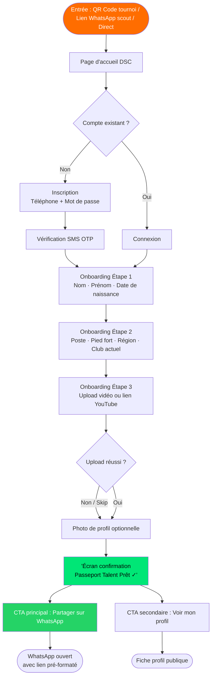
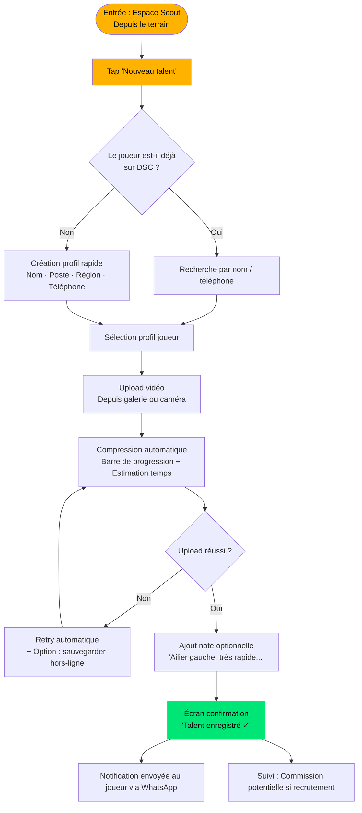

# UX Design Specification dream_studio_connect

**Author:** falcom
**Date:** 2026-03-17

---

<!-- UX design content will be appended sequentially through collaborative workflow steps -->

## Executive Summary

### Project Vision

Dream Studio Connect est la première plateforme camerounaise PWA de mise en relation entre footballeurs amateurs/semi-professionnels et agents de football locaux. Elle donne une existence numérique permanente aux talents invisibles via un "Passeport Talent" créable en moins de 5 minutes, partageable sur WhatsApp depuis un Android bas de gamme en 2G/3G.

### Target Users

**Joueur (Kevin — Le Talent Invisible) :** 15-27 ans, Android bas de gamme, connexion 3G instable, francophone. Objectif : exister numériquement et être vu par un agent. Moment "aha" : un agent lui écrit via son lien WhatsApp.

**Agent (Maurice — L'Agent Frustré) :** 38 ans, opère à Yaoundé/Douala. Objectif : trouver "défenseur central, 17-22 ans, région Centre" depuis son téléphone sans se déplacer. Moment "aha" : profil avec 3 vidéos + validations coaches trouvé en quelques clics.

**Admin (falcom) :** Gestionnaire de la plateforme. Besoin : vue d'ensemble claire, outils d'action rapide (validation, certification, modération), analytics globaux.

**Scout Citoyen :** Terrain, upload vidéos, tagging joueurs, suivi commissions. Interface terrain-first, simple et rapide.

**Parent de joueur mineur :** Décideur silencieux, méfiant. Rassuré par la transparence des profils, les badges certifiés et la traçabilité.

### Key Design Challenges

1. **Performances sous contrainte réseau** — chaque kilo-octet compte : compression vidéo serveur, images optimisées, UI légère compatible 2G/3G et Android bas de gamme (cible : First Contentful Paint < 3s en 3G).
2. **Onboarding joueur ≤ 5 minutes** — formulaire minimal, progression visuelle claire, friction zéro, guidage par icônes plutôt que texte long.
3. **Établir la confiance** — badges de certification visibles, profils validés par coaches, transparence totale pour rassurer agents et parents de mineurs.

### Design Opportunities

1. **WhatsApp comme vecteur UX central** — le lien de partage unique du Passeport Talent n'est pas une option secondaire : c'est le principal mécanisme de distribution et de viralité. Le design doit le mettre en avant systématiquement.
2. **Interface accessible et inclusive** — priorité aux icônes + labels courts, au visuel sur le texte, au multilingue FR/EN natif et au thème Dark/Light — différenciateur fort sur un marché vierge.
3. **Écosystème physique digitalisé** — le tournoi DSC comme point d'entrée UX : le Scout Citoyen est l'interface humaine terrain, la PWA est l'interface numérique. Concevoir ces deux points de contact comme un seul parcours fluide.

---

## Core User Experience

### Defining Experience

L'expérience centrale de Dream Studio Connect repose sur deux actions miroir :

- **Côté Joueur :** créer son Passeport Talent en < 5 minutes et le partager sur WhatsApp — transformer l'invisible en visible, immédiatement.
- **Côté Agent :** rechercher un profil qualifié (poste + âge + région) et le contacter directement depuis son téléphone — remplacer deux weekends de déplacement par une recherche de 3 minutes.

Ces deux actions sont le moteur de valeur de la plateforme. Tout le design gravite autour d'elles.

### Platform Strategy

- **PWA mobile-first** — aucune installation, accessible depuis n'importe quel Android via navigateur
- **Contrainte réseau** — design conçu pour 2G/3G : assets minimisés, images compressées, lazy loading agressif, cible FCP < 3s en 3G
- **Tactile-first** — cibles tactiles ≥ 44px, navigation pouce, zéro hover-dependent interactions
- **WhatsApp natif** — le partage de lien profil est un point d'entrée UX de premier rang, pas un afterthought
- **Pas d'offline au MVP** — mais architecture progressive : hooks prévus pour SW et cache en V1.0

### Effortless Interactions

1. **Partage WhatsApp** — bouton persistant sur chaque profil joueur, un seul tap, lien pré-formaté avec prévisualisation
2. **Upload vidéo** — progression visible, compression en arrière-plan transparente, feedback rassurant ("Vidéo en cours d'optimisation...")
3. **Moteur de recherche agent** — filtres poste/âge/région accessibles en 2 taps, résultats chargés en < 2s, cards profil scannables rapidement
4. **Onboarding joueur** — formulaire en étapes (pas tout d'un coup), auto-save à chaque étape, reprise possible si coupure réseau

### Critical Success Moments

| Utilisateur | Moment critique | Signal de réussite |
|---|---|---|
| Joueur | Partager son lien WhatsApp pour la première fois | Il voit sa fiche profil s'afficher comme une vraie carte de visite |
| Joueur | Recevoir un premier contact agent | Notification ou message — la plateforme a tenu sa promesse |
| Agent | Trouver un profil qualifié sans se déplacer | Recherche → profil avec vidéo + validation en < 3 min |
| Agent | Contacter un joueur directement | Un seul tap pour ouvrir WhatsApp ou la messagerie |
| Scout Citoyen | Uploader une vidéo terrain | Upload réussi en < 2 min, feedback de confirmation immédiat |

### Experience Principles

1. **Visibilité avant tout** — chaque joueur doit sentir qu'il existe vraiment en ligne dès la fin de son onboarding
2. **Zéro friction sur le partage** — le bouton WhatsApp est le CTA principal sur toute fiche joueur, jamais caché
3. **Performance = respect** — une UI lente sur un Android bas de gamme est un mur qui exclut ; la performance est un acte d'inclusion
4. **Confiance par la transparence** — badges, validations et certifications sont des éléments visuels de premier plan, pas des métadonnées cachées
5. **Progressive disclosure** — montrer peu, guider fort ; les fonctionnalités avancées émergent naturellement avec l'usage

---

## Desired Emotional Response

### Primary Emotional Goals

**Joueur — Fierté et Espoir :**
Le moment où le joueur partage son lien Passeport Talent doit déclencher un sentiment de fierté réelle : il existe numériquement pour la première fois. L'espoir suit naturellement — "quelqu'un va enfin me voir". Cette émotion doit être renforcée à chaque étape de l'onboarding par un micro-copy motivant et une interface qui valorise visuellement le profil créé.

**Agent — Efficacité et Confiance :**
L'agent doit ressentir un soulagement tangible : trouver le bon profil depuis son téléphone en moins de 3 minutes, sans déplacement. La confiance s'installe quand les profils sont riches (vidéos + validations) et que la plateforme semble sérieuse, structurée, certifiée.

**Scout Citoyen — Légitimité et Appartenance :**
Le scout doit se sentir reconnu comme un acteur clé de l'écosystème — pas un simple uploadeur, mais un "yeux" officiel de DSC sur le terrain. Son badge et son suivi de commission lui donnent un sentiment de légitimité et d'appartenance à une mission collective.

### Emotional Journey Mapping

| Étape | Joueur | Agent |
|---|---|---|
| Découverte | Curiosité prudente → "Ça marche vraiment ?" | Scepticisme → "Encore une promesse ?" |
| Onboarding | Encouragement → progrès visible, pas à pas | Facilité → inscription rapide, période d'essai |
| Action principale | **Fierté** → profil créé, lien partagé | **Efficacité** → profil trouvé en 3 min |
| Premier succès | **Espoir → Joie** → premier message agent reçu | **Confiance** → premier recrutement via DSC |
| Retour | Fidélité → "C'est ma vitrine permanente" | Habitude → "Je cherche ici avant tout déplacement" |
| Erreur/Lenteur | Frustration tolérable → feedback clair, pas de blocage muet | Impatience → indicateurs de chargement honnêtes |

### Micro-Emotions

- **Confiance vs Méfiance** → critique pour le parent du joueur mineur et l'agent : badges de certification visibles, profils validés par coaches en première ligne
- **Fierté vs Honte** → le profil joueur doit être visuellement soigné — une fiche laide ou vide génère de la honte, frein à la recommandation
- **Espoir vs Découragement** → micro-copy motivant à chaque étape d'onboarding, pas de "vide" après création du profil
- **Appartenance vs Isolement** → le scout et l'admin doivent sentir qu'ils font partie d'une communauté structurée ("réseau DSC certifié")
- **Soulagement vs Frustration** → l'agent qui trouve un bon profil rapidement ressent un soulagement fort ; la lenteur les détourne définitivement

### Design Implications

- **Fierté → Profil visuellement valorisé** — grande photo, nom bien affiché, badge "Passeport Talent Officiel", CTA partage WhatsApp toujours visible
- **Espoir → Micro-copy encourageant** — "Votre profil est visible par les agents de votre région", compteur de vues de profil (futur), messages de progression
- **Confiance → Signaux de crédibilité** — badges certifiés DSC, validations coaches affichées en évidence, nombre de joueurs sur la plateforme affiché
- **Efficacité → UI de recherche rapide** — filtres persistants, résultats instantanés (skeleton screen pendant chargement), cards scannables en < 5 secondes
- **Appartenance → Identité visuelle forte** — chaque acteur (joueur, agent, scout) a une couleur/identité propre dans l'interface, renforçant son rôle
- **Éviter la Frustration → Feedback honnête** — indicateurs de progression lors des uploads, messages d'erreur humains (pas techniques), auto-save silencieux

### Emotional Design Principles

1. **"Je compte"** — chaque joueur doit sentir que sa fiche est une vitrine digne de lui, pas juste un formulaire rempli
2. **"Ça marche"** — chaque action principale (partage, recherche, contact) doit donner un feedback immédiat et rassurant
3. **"Je suis entre de bonnes mains"** — la certification, les badges et la validation communautaire construisent la confiance progressive
4. **"C'est fait pour moi"** — l'interface s'adapte aux contraintes réelles (réseau lent, écran bas de gamme) sans jamais en faire ressentir la limitation
5. **"Je veux y revenir"** — après chaque session réussie, l'utilisateur doit repartir avec un sentiment de valeur reçue — pas juste de la fonctionnalité accomplie

---

## UX Pattern Analysis & Inspiration

### Inspiring Products Analysis

**myfootballconcept.com** — Référence pour la grille joueurs
Seul des 5 sites à offrir une liste de joueurs filtrables par poste (TOUS / DÉFENSEUR / MILIEU / ATTAQUANT). C'est la représentation la plus proche du moteur de recherche agent de DSC. Cependant, les profils sont créés par l'agence elle-même (pas par le joueur) et il n'y a aucun mécanisme de partage ni de contact direct.

**nova-soccer-agency.com** — Référence pour la segmentation d'audience
Page d'accueil avec 3 entrées distinctes (Agent Sportif Indépendant / Scouts / Club de Football). Ce modèle de role-based navigation est directement transférable à l'écran d'accueil de DSC pour orienter joueur, agent et scout vers leurs parcours respectifs.

**shoow-up.com** — Référence pour l'intégration tournois-plateforme
Liste de détections futures avec date, lieu et catégorie clairement affichés. Logos clubs partenaires comme signaux de crédibilité. Ce modèle inspire la future page Tournois DSC (V1.0) et la logique "événement physique → inscription numérique".

**signsoccer.com** — Référence pour la communication valeurs et confiance famille
Communication explicite des valeurs (Confiance, Cadre Familial, Sérénité) et inclusion des parents dans l'accompagnement. Ce ton et cette approche doivent informer le micro-copy de DSC, notamment sur les pages visibles par les parents de joueurs mineurs.

**falsport.be** — Référence pour la crédibilité par certification
Affichage du numéro de licence FIFA dès le footer, hiérarchie claire des services. Ce signal de sérieux inspire la façon dont DSC affichera les badges "Agent Certifié DSC" et les numéros de certification.

### Transferable UX Patterns

**Navigation & Structure**
- Filtres poste + grille joueurs (myfootballconcept) → adopter et enrichir avec filtres âge + région + disponibilité
- Triple entrée par rôle sur homepage (nova-soccer) → adapter pour DSC : Joueur / Agent / Scout avec CTA distincts

**Interaction & Fonctionnel**
- Événements à venir avec date/lieu/catégorie (shoow-up) → adopter pour page Tournois DSC V1.0
- Badge certification affiché en permanence (falsport) → adopter pour agents certifiés DSC, visible sur chaque profil et dans le footer

**Confiance & Crédibilité**
- Communication valeurs + famille (signsoccer) → intégrer dans micro-copy onboarding joueur et page landing parents
- Logos partenaires certifiés (shoow-up) → adapté en "X agents certifiés sur DSC" comme preuve sociale dynamique

### Anti-Patterns to Avoid

1. **Formulaire de contact unique comme seul canal** (tous les 5 sites) → sur DSC, le contact passe par messagerie directe intégrée ou ouverture WhatsApp natif — zéro formulaire en mode MVP
2. **Desktop-first sans adaptation mobile** (tous les 5 sites) → anti-pattern majeur pour DSC dont 100% des utilisateurs sont sur Android en 2G/3G
3. **Profil joueur géré exclusivement par l'agence** (myfootballconcept, falsport) → sur DSC, le joueur crée lui-même son Passeport Talent — l'agence valide seulement
4. **Aucun mécanisme de partage viral** (tous les 5 sites) → le lien WhatsApp partageable est le vecteur de croissance central de DSC — absent de tous les concurrents
5. **Pas de moteur de recherche filtré en self-service** (tous sauf myfootballconcept partiellement) → l'agent cherche lui-même, DSC ne présélectionne pas pour lui

### Design Inspiration Strategy

**À adopter directement :**
- Grille joueurs filtrable par poste → pivot central du moteur de recherche agent
- Role-based homepage (Joueur / Agent / Scout) → premier écran de la PWA
- Badge de certification visible en permanence → toujours affiché sur profils agents et fiches joueurs certifiés

**À adapter pour le contexte DSC :**
- Page tournois (shoow-up) → simplifiée pour mobile, avec lien d'inscription direct et redirection vers création de profil joueur post-événement
- Communication valeurs famille (signsoccer) → ton adapté au contexte camerounais : respect de la famille, transparence, confiance communautaire

**À éviter absolument :**
- Formulaires de contact → remplacés par WhatsApp natif et messagerie intégrée
- UI desktop-first → tout conçu mobile-first, chaque composant testé en 320px
- Profil joueur passif → le joueur est acteur de sa propre visibilité dès l'onboarding

---

## Design System Foundation

### Design System Choice

**Tailwind CSS v4 + shadcn/ui**

Système thémable basé sur des utilitaires CSS atomiques (Tailwind) et une bibliothèque de composants accessibles et copiables directement dans le projet (shadcn/ui, basé sur Radix UI primitives).

### Rationale for Selection

1. **Bundle ultra-léger** — Tailwind génère uniquement les classes CSS utilisées (PurgeCSS intégré), critique pour garantir un First Contentful Paint < 3s en 2G/3G sur Android bas de gamme
2. **Dark/Light mode natif** — le système `dark:` variant de Tailwind + CSS custom properties permet d'implémenter les deux thèmes sans surcouche, dès le sprint 1
3. **shadcn/ui : aucune dépendance runtime** — les composants sont copiés dans le projet, pas d'import de bibliothèque externe volumineuse ; accessibilité ARIA gérée par Radix UI
4. **Design tokens flexibles** — CSS custom properties (`--color-primary`, `--radius`, etc.) permettent de définir l'identité DSC sans lutter contre un thème tiers
5. **i18n-compatible** — aucune contrainte sur les tailles de texte FR/EN ou les variations de longueur de chaînes
6. **Écosystème mature** — documentation exhaustive, support communautaire fort, compatible Next.js/Vite/React (stack PWA cible)

### Implementation Approach

**Tokens de design (CSS custom properties) :**

```css
:root {
  /* Couleurs DSC */
  --color-primary: #[vert-terrain];        /* Couleur principale DSC */
  --color-agent: #[bleu-pro];              /* Identité espace Agent */
  --color-joueur: #[orange-talent];        /* Identité espace Joueur */
  --color-scout: #[jaune-terrain];         /* Identité espace Scout */
  --color-surface: #ffffff;
  --color-background: #f8f9fa;

  /* Typographie */
  --font-sans: 'Inter', system-ui, sans-serif;
  --font-size-base: 16px;                  /* Minimum absolu pour Android bas de gamme */

  /* Espacement & rayon */
  --radius: 8px;
  --touch-target: 44px;                    /* Cible tactile minimum WCAG */
}

.dark {
  --color-surface: #1a1a1a;
  --color-background: #0d0d0d;
  /* ... overrides dark mode */
}
```

**Composants shadcn/ui prioritaires pour le MVP :**
- `Button` — CTA WhatsApp, actions primaires
- `Card` — Fiche joueur, résultats de recherche
- `Input` / `Select` — Filtres agent, formulaire onboarding
- `Badge` — Certifications, postes, statuts
- `Progress` — Barre d'avancement onboarding joueur
- `Sheet` / `Dialog` — Overlays mobile-first
- `Skeleton` — Loading states pendant chargement réseau lent
- `Toast` — Feedback actions (upload réussi, partage WhatsApp, etc.)

**Stratégie de performances :**
- Images : WebP + lazy loading systématique
- Icônes : Lucide React (tree-shakeable, SVG inline)
- Fonts : subset latin + latin-ext uniquement, `font-display: swap`
- Vidéos : thumbnail seul au chargement, lecture à la demande

### Customization Strategy

**Identité visuelle DSC :**
- Couleur primaire unique DSC (à définir avec falcom) — servira de fil rouge sur les 3 espaces
- Chaque espace utilisateur (Joueur / Agent / Scout / Admin) a un accent coloré propre — renforcement visuel du rôle
- Typographie : Inter (lisibilité optimale sur petits écrans Android, gratuite, Google Fonts)
- Iconographie : Lucide React — cohérence visuelle, SVG légers, accessibles

**Règles de personnalisation :**
- Jamais surcharger les composants shadcn/ui directement — toujours via les tokens CSS ou des wrappers nommés (`PlayerCard`, `AgentSearchFilter`, etc.)
- Tout nouveau composant custom suit la convention de nommage shadcn/ui et est documenté dans `/components/ui/`
- Le thème Dark/Light est géré uniquement via les CSS custom properties — aucun style conditionnel JS

---

## Core User Experience — Defining Experience

### 2.1 Defining Experience

**Côté Joueur :** “Crée ton Passeport Talent en 5 minutes et partage-le sur WhatsApp”
**Côté Agent :** “Trouve le joueur qu’il te faut en moins de 3 minutes depuis ton téléphone”

L’expérience joueur est le moteur de valeur de toute la plateforme : sans profils joueurs créés et partagés, il n’y a rien à chercher pour l’agent. C’est aussi l’expérience la plus différenciante — aucun concurrent ne propose au joueur de créer lui-même son profil partageable via WhatsApp.

### 2.2 User Mental Model

**Joueur :** Il pense à son profil comme à une “carte de visite” ou un “CV de terrain” — quelque chose qu’il possède et qu’il montre aux gens qui comptent. Le modèle mental est celui du partage WhatsApp qu’il pratique déjà, mais avec un contenu permanent et structuré plutôt qu’éphémère.

**Frustrations actuelles :** ses vidéos disparaissent, personne hors de son réseau ne le voit, il n’a aucun moyen de se “montrer” à distance.

**Agent :** Il pense à sa recherche comme à un “fichier joueurs filtrable” — l’équivalent numérique de son carnet de contacts terrain. Le modèle mental est celui d’un moteur de recherche simple (poste + âge + région), sans complexité Transfermarkt.

**Frustrations actuelles :** devoir se déplacer 2 weekends/mois, dépendre du bouche à oreille, aucune structure dans ses contacts WhatsApp.

### 2.3 Success Criteria

**Joueur — l’interaction réussit si :**
- Le profil est créé et partagé en < 5 minutes (cible : même sur 3G instable)
- Le joueur voit immédiatement son lien WhatsApp fonctionner (prévisualisation de la fiche dans WhatsApp)
- Il reçoit un premier contact agent dans les 30 jours suivant la création

**Agent — l’interaction réussit si :**
- Les filtres (poste + âge + région) sont accessibles en 2 taps depuis la homepage
- Les résultats chargent en < 2s (skeleton screen visible en attendant)
- La fiche joueur contient assez d’info pour décider de contacter sans se déplacer (vidéo + validation coach)
- Le contact joueur s’ouvre en 1 tap (WhatsApp ou messagerie intégrée)

### 2.4 Novel vs. Established Patterns

**Ce qui est établi (patterns connus des utilisateurs) :**
- Formulaire multi-étapes avec barre de progression → connu via WhatsApp Business, Facebook
- Grille de résultats filtrables → connu via toute app de recherche/e-commerce
- Tap pour partager via WhatsApp → réflexe universel en Afrique sub-saharienne

**Ce qui est nouveau (à éduquer) :**
- Le concept de “profil permanent partageable” n’existe pas dans l’usage WhatsApp habituel → besoin de micro-copy expliquant “votre lien reste actif pour toujours”
- Le Passeport Talent comme identité numérique officielle → le badge DSC donne une légitimité inédite → à expliquer à l’onboarding

**Métaphore pédagogique à utiliser** : “Ton Passeport Talent, c’est ta carte de visite de footballeur — elle reste en ligne et tout le monde peut la trouver”

### 2.5 Experience Mechanics

**Parcours joueur — Création du Passeport Talent :**

| Étape | Action utilisateur | Réponse système |
|---|---|---|
| 1. Identité | Saisit nom, date de naissance, région | Auto-save silencieux, progression 25% |
| 2. Profil sportif | Sélectionne poste(s), pied fort, club actuel | Sélecteurs visuels (icônes par poste), progression 50% |
| 3. Vidéo | Upload vidéo ou lien YouTube | Compression arrière-plan, preview thumbnail, progression 75% |
| 4. Photo | Photo de profil (optionnel mais recommandé) | Recadrage automatique, progression 90% |
| 5. Confirmation | Valide la fiche | Écran succès “Passeport Talent Prêt ✓” + CTA WhatsApp immédiat |

**Parcours agent — Recherche filtrée :**

| Étape | Action utilisateur | Réponse système |
|---|---|---|
| 1. Filtres | Sélectionne poste + tranche d’âge + région | Résultats mis à jour en temps réel ou au tap “Rechercher” |
| 2. Résultats | Scroll vertical de cards joueurs | Cards scannables : photo + nom + poste + région + badge validation |
| 3. Profil | Tap sur une card | Fiche complète : stats + vidéo(s) + validations + bouton contact |
| 4. Contact | Tap “Contacter” | Ouverture WhatsApp pré-rempli OU messagerie intégrée DSC |

---

## Visual Design Foundation

### Color System

**Palette DSC — Mix personnalisé dark-first :**

```css
:root {
  /* Couleur principale */
  --color-primary:        #00E676;  /* Vert électrique — fil rouge DSC */
  --color-primary-dark:   #00BF5A;  /* Variante hover/active */

  /* Accents par espace utilisateur */
  --color-joueur:         #FF6D00;  /* Orange talent — espace Joueur */
  --color-agent:          #2979FF;  /* Bleu pro — espace Agent */
  --color-scout:          #FFB300;  /* Ambre terrain — espace Scout */
  --color-admin:          #7C4DFF;  /* Violet autorité — espace Admin */

  /* Surfaces — Light mode */
  --color-background:     #F5F5F5;
  --color-surface:        #FFFFFF;
  --color-surface-2:      #F0F0F0;
  --color-text:           #121212;
  --color-text-muted:     #6B7280;

  /* Sémantique */
  --color-success:        #00C853;
  --color-warning:        #FFD600;
  --color-error:          #FF3D00;
  --color-info:           #2979FF;

  /* Rayon & touch */
  --radius-sm:            6px;
  --radius-md:            8px;
  --radius-lg:            12px;
  --radius-full:          9999px;
  --touch-target:         44px;
}

.dark {
  /* Surfaces — Dark mode (prioritaire) */
  --color-background:     #0D0D0D;
  --color-surface:        #1C1C1E;
  --color-surface-2:      #2C2C2E;
  --color-text:           #FFFFFF;
  --color-text-muted:     #9CA3AF;
}
```

**Logique de la palette :**
- Le vert électrique `#00E676` sur fond sombre anthracite crée un contraste ratio > 7:1 (WCAG AAA) — excellent pour Android bas de gamme
- Chaque espace utilisateur a une couleur d'accent propre, visible immédiatement sans lecture du label
- Les couleurs de rôle sont toutes saturées et distinctes les unes des autres (testées pour le daltonisme)

### Typography System

**Police principale : Poppins (Google Fonts — subset latin)**

Rationale : Poppins apporte la rondeur et la chaleur nécessaires pour équilibrer l'énergie du vert électrique. Excellent rendu sur les petits écrans Android, formes ouvertes et lisibles même à 14px.

```css
:root {
  --font-family:          'Poppins', system-ui, sans-serif;
  --font-size-xs:         12px;
  --font-size-sm:         14px;
  --font-size-base:       16px;   /* Minimum absolu Android */
  --font-size-lg:         18px;
  --font-size-xl:         20px;
  --font-size-2xl:        24px;
  --font-size-3xl:        30px;
  --font-size-4xl:        36px;

  --font-weight-regular:  400;
  --font-weight-medium:   500;
  --font-weight-semibold: 600;
  --font-weight-bold:     700;

  --line-height-tight:    1.25;
  --line-height-normal:   1.5;
  --line-height-relaxed:  1.75;
}
```

**Hiérarchie typographique :**

| Niveau | Taille | Poids | Usage |
|---|---|---|---|
| H1 | 30px / Semibold | 600 | Titre écran principal |
| H2 | 24px / Semibold | 600 | Sections, titres de page |
| H3 | 20px / Medium | 500 | Sous-sections, noms joueurs |
| Body | 16px / Regular | 400 | Texte courant |
| Caption | 14px / Regular | 400 | Labels, dates, info secondaire |
| Micro | 12px / Medium | 500 | Badges, tags, statuts |

**Chargement optimisé :**
```html
<link rel="preconnect" href="https://fonts.googleapis.com">
<link href="https://fonts.googleapis.com/css2?family=Poppins:wght@400;500;600;700&display=swap&subset=latin" rel="stylesheet">
```

### Spacing & Layout Foundation

**Grille de base : 8px**

```css
:root {
  --space-1:   4px;
  --space-2:   8px;   /* Base */
  --space-3:   12px;
  --space-4:   16px;
  --space-5:   20px;
  --space-6:   24px;
  --space-8:   32px;
  --space-10:  40px;
  --space-12:  48px;
  --space-16:  64px;

  /* Layout */
  --container-max:   480px;   /* Mobile-first, max width centré sur tablette */
  --page-padding-x:  16px;    /* Padding horizontal côté écran */
  --card-padding:    16px;
  --nav-height:      56px;    /* Bottom navigation bar */
  --touch-target:    44px;    /* Cible tactile minimum WCAG */
}
```

**Structure de layout mobile-first :**
- Navigation : bottom tab bar (56px) — navigation pouce, jamais de hamburger menu caché
- Contenu : scroll vertical, padding horizontal 16px, max-width 480px centré
- Cards joueurs : pleine largeur (- 32px) avec padding interne 16px
- Filtres agent : sticky top ou bottom sheet selon le contexte

### Accessibility Considerations

- **Contraste** : ratio minimum 4.5:1 (WCAG AA) sur tout le texte — vert électrique sur fond sombre atteint > 7:1
- **Cibles tactiles** : 44px × 44px minimum sur tous les éléments interactifs
- **Taille police** : 16px minimum — jamais en-dessous pour le texte courant
- **Focus visible** : outline visible sur tous les éléments interactifs (mode accessibilité)
- **Alt text** : toute image de joueur a un alt descriptif généré automatiquement (nom + poste)
- **Dark/Light** : basculement automatique via `prefers-color-scheme` + bascule manuelle persistant en localStorage
- **i18n** : police Poppins supporte les caractères étendus FR/EN, pas de problème de glyphe

---

## User Journey Flows

### Journey 1 — Joueur : Création du Passeport Talent

**Description :** Le joueur crée son profil en moins de 5 minutes, depuis un tournoi DSC ou en autonomie, et partage son lien WhatsApp immédiatement.



**Points d'optimisation :**
- Auto-save après chaque étape — reprise possible si coupure réseau
- Barre de progression 5 étapes toujours visible en haut
- Micro-copy encourageant à chaque transition ("Super ! 2 étapes restantes")
- Upload vidéo : compression arrière-plan + thumbnail preview immédiat
- Écran succès : grande photo profil + nom en H1 + CTA WhatsApp vert pleine largeur

---

### Journey 2 — Agent : Recherche filtrée & Contact joueur

**Description :** L'agent cherche un profil qualifié depuis son téléphone et contacte le joueur directement, sans déplacement.

```mermaid
flowchart TD
    A([Entrée : Accueil Agent]) --> B[Moteur de recherche\nFiltres : Poste · Âge · Région]
    B --> C[Tap 'Rechercher']
    C --> D{Résultats trouvés ?}
    D -- Oui --> E[Grille de cards joueurs\nPhoto · Nom · Poste · Région · Badge]
    D -- Non --> F[Message 'Aucun profil'\n+ suggestion modifier filtres]
    F --> B
    E --> G[Scroll vertical\nSkeleton screen si chargement]
    G --> H[Tap sur une card joueur]
    H --> I[Fiche complète joueur\nStats · Vidéo(s) · Validations coaches · Badge certifié]
    I --> J{Intéressé ?}
    J -- Non --> K[Retour liste\nÉtat filtres conservé]
    K --> G
    J -- Oui --> L[Tap 'Contacter']
    L --> M{Canal de contact}
    M -- WhatsApp --> N([WhatsApp ouvert\nMessage pré-formaté avec nom joueur])
    M -- Messagerie DSC --> O([Conversation sécurisée\nIntégrée dans l'app])
    N --> P([Mise en relation réussie ✓])
    O --> P

    style P fill:#00E676,color:#000
    style L fill:#2979FF,color:#fff
    style A fill:#2979FF,color:#fff
```

**Points d'optimisation :**
- Filtres pré-remplis selon la dernière recherche (persistance localStorage)
- Skeleton screen pendant chargement — jamais d'écran vide
- Cards joueurs : max 3 infos scannables en < 2 secondes (photo + poste + région)
- Fiche joueur : vidéo accessible en 1 tap, lecture à la demande (pas autoplay)
- Bouton "Contacter" toujours sticky en bas de fiche, jamais hors écran

---

### Journey 3 — Scout Citoyen : Upload vidéo terrain

**Description :** Le scout filme un joueur lors d'un match de quartier et uploade la vidéo depuis le bord du terrain, en moins de 2 minutes.



**Points d'optimisation :**
- Interface terrain-first : gros boutons, peu de texte, actions en 3 taps max
- Gestion robuste de la coupure réseau : file d'upload avec retry automatique
- Feedback upload honnête : barre de progression + estimation du temps restant
- Note scout : optionnelle, input vocal possible (clic micro) pour les mains occupées
- Tracking commission : toujours visible dans le dashboard scout → motivation

---

### Journey Patterns

**Patterns de navigation :**
- Bottom tab bar fixe (Accueil / Recherche / Mon Profil / Notifications) — navigation pouce systématique
- Retour toujours disponible via swipe gauche (natif Android) ou flèche gauche header
- État des filtres/formulaires conservé lors du retour en arrière — jamais de perte de données

**Patterns de feedback :**
- Toute action async (upload, recherche, inscription) → indicateur de loading immédiat (< 100ms)
- Succès → écran dédié vert `#00E676` avec icône ✓ et CTA principal — jamais juste un toast
- Erreur → message humain + action corrective proposée — jamais de code d'erreur technique

**Patterns de progression :**
- Formulaires multi-étapes : barre de progression segmentée (pas de pourcentage abstrait)
- Auto-save silencieux à chaque étape — indicateur discret “Sauvegardé”
- Reprise de session : si l'app est quittée en cours d'onboarding, reprise à l'étape exacte

### Flow Optimization Principles

1. **Minimum de taps vers la valeur** — Joueur : 5 étapes max pour partager son lien. Agent : 3 taps de la recherche au contact.
2. **Jamais d'écran vide** — Skeleton screens, états de chargement honnêtes, messages d'état clairs.
3. **Zéro perte de données** — Auto-save systématique, retry automatique pour les uploads, persistance des filtres.
4. **Feedback immédiat** — Toute action reçoit un retour visuel en < 100ms, même si le traitement prend plus longtemps.
5. **Récupération gracieuse** — Chaque erreur propose une action corrective contextuelle, pas un dead-end.

---

## Component Strategy

### Design System Components

**Tailwind CSS v4 + shadcn/ui couvre directement :**

| Composant shadcn/ui | Usage DSC |
|---|---|
| `Button` | Tous les CTAs primaires/secondaires, bouton WhatsApp |
| `Card` | Conteneur générique fiches, sections |
| `Input` / `Textarea` | Formulaires onboarding joueur, notes scout |
| `Select` | Filtres poste, région, âge agent |
| `Badge` | Postes joueur, statuts, certifications |
| `Progress` | Barre avancement onboarding (stylisée custom) |
| `Skeleton` | Loading states grille joueurs, fiche profil |
| `Toast` | Notifications légères (sauvegarde, partage réussi) |
| `Dialog` | Confirmation actions critiques (supprimer, signaler) |
| `Sheet` | Bottom sheet filtres agent sur mobile |
| `Avatar` | Photo de profil joueur partout |
| `Tabs` | Navigation sections profil joueur (Infos / Vidéos / Stats) |
| `Separator` | Séparations visuelles sections |

### Custom Components

#### `PassportCard`
**Purpose :** La fiche Passeport Talent publique du joueur — point d'entrée depuis WhatsApp.
**Anatomy :** Photo pleine largeur (aspect 4:3) → Badge DSC certifié → Nom H1 + Âge → Poste(s) + Région + Club → Statistiques clés → Vidéo(s) thumbnail → Validations coaches → CTA WhatsApp sticky bas.
**États :** `default` / `certified` (badge vert) / `pending` (badge gris) / `skeleton` (chargement)
**Variantes :** `compact` (card résultat recherche) / `full` (vue détaillée)
**Accessibilité :** `role="article"`, `aria-label="Passeport Talent de [Nom]"`, alt photo auto-généré

#### `PlayerSearchCard`
**Purpose :** Card résultat dans la grille de recherche agent — scannable en < 2 secondes.
**Anatomy :** Avatar (56px) → Nom + Âge → Badge poste + Badge région → Indicateur validations → Chevron droit.
**États :** `default` / `hover` (élévation légère) / `skeleton`
**Règle :** Max 4 informations visibles — jamais plus sur cette card

#### `StepProgressBar`
**Purpose :** Barre de progression segmentée pour l'onboarding joueur (5 étapes).
**Anatomy :** 5 segments colorés (remplis = `--color-primary`, vides = `--color-surface-2`) + label étape courante en dessous.
**États :** `active` / `completed` / `pending`
**Animation :** Transition smooth 300ms sur remplissage segment

#### `WhatsAppShareButton`
**Purpose :** CTA de partage WhatsApp — toujours présent sur la PassportCard.
**Anatomy :** Icône WhatsApp SVG + Label "Partager sur WhatsApp" + couleur `#25D366`
**Comportement :** `window.open('https://wa.me/?text=...')` avec lien profil pré-encodé
**Variantes :** `full-width` (écran succès onboarding) / `icon-only` (actions secondaires)
**Accessibilité :** `aria-label="Partager le profil de [Nom] sur WhatsApp"`

#### `VideoUploadZone`
**Purpose :** Zone d'upload vidéo avec feedback progression temps réel.
**Anatomy :** Zone drop (ou tap pour galerie/caméra) → Barre progression % + estimation temps → Thumbnail preview post-upload → Bouton supprimer
**États :** `idle` / `uploading` (progress bar) / `success` (thumbnail + ✓) / `error` (message humain + retry)
**Contrainte :** Compression automatique côté serveur — feedback "Optimisation en cours..." pendant le traitement

#### `RoleBadge`
**Purpose :** Badge identitaire par rôle utilisateur — renforcement visuel permanent.
**Variantes :** `joueur` (orange `#FF6D00`) / `agent-certified` (bleu `#2979FF` + icône ✓) / `scout` (ambre `#FFB300`) / `admin` (violet `#7C4DFF`)
**Usage :** Headers d'espace, profils, cartes résultats

#### `FilterBar`
**Purpose :** Barre de filtres recherche agent — sticky top, accessible en 2 taps.
**Anatomy :** 3 selects horizontaux (Poste / Âge / Région) + Bouton "Rechercher" pleine largeur dessous
**Comportement :** Persistance des valeurs en localStorage — rechargement = filtres restaurés
**Mobile :** Sur petit écran, bascule en bottom sheet (`Sheet` shadcn/ui)

#### `BottomNavBar`
**Purpose :** Navigation principale — toujours visible, navigation pouce.
**Anatomy :** 4 tabs : Accueil / Recherche / Mon Profil / Notifications — icône Lucide + label court
**Hauteur :** 56px + safe-area-inset-bottom (Android edge)
**Active state :** Couleur accent du rôle utilisateur connecté (orange joueur, bleu agent, etc.)

### Component Implementation Strategy

- Tous les composants custom sont construits **au-dessus des primitives shadcn/ui** — jamais from scratch
- Nommage : PascalCase, préfixe `Dsc` pour les composants métier (`DscPassportCard`, `DscFilterBar`)
- Stockage : `/src/components/ui/` (shadcn/ui) + `/src/components/dsc/` (custom DSC)
- Chaque composant custom expose les props `className` et `data-testid` pour extensibilité et tests

### Implementation Roadmap

**Sprint 1 — Fondations :**
`BottomNavBar` / `RoleBadge` / `StepProgressBar`

**Sprint 2 — Cœur joueur :**
`VideoUploadZone` / `PassportCard` (full) / `WhatsAppShareButton`

**Sprint 3 — Cœur agent :**
`PlayerSearchCard` / `PassportCard` (compact) / `FilterBar`

**Sprint 4+ — Enrichissement :**
Dashboard scout, certifications, back-office admin

---

## UX Consistency Patterns

### Button Hierarchy

**Règle générale :** Maximum 1 bouton primaire par écran — jamais deux actions en compétition.

| Niveau | Style Tailwind | Usage |
|---|---|---|
| **Primaire** | `bg-[--color-primary] text-black font-semibold h-12 rounded-lg w-full` | Action principale de l'écran (Partager, Rechercher, Valider) |
| **Secondaire** | `border border-[--color-primary] text-[--color-primary] h-12 rounded-lg` | Action alternative (Voir profil, Plus tard) |
| **Ghost** | `text-[--color-text-muted] h-10` | Actions tertiaires (Annuler, Passer) |
| **Destructif** | `bg-[--color-error] text-white h-12 rounded-lg` | Suppression, signalement — toujours précédé d'une confirmation Dialog |
| **WhatsApp** | `bg-[#25D366] text-white h-12 rounded-lg` | Partage WhatsApp uniquement — jamais détourné |

**Règles mobiles :**
- Hauteur minimum bouton : 48px
- Boutons pleine largeur sur mobile pour les actions primaires
- Jamais deux boutons côte à côte sur < 375px — empilement vertical

---

### Feedback Patterns

**Succès (action importante) :**
Écran dédié plein écran fond `#00E676`, icône ✓ animée, titre H1, sous-titre encourageant, CTA principal.
Exemples : profil créé, mise en relation réussie, vidéo uploadée.

**Succès (action légère) :**
`Toast` en bas d'écran, durée 3s, fond surface-2 avec bordure verte.
Exemples : sauvegarde automatique, copie de lien.

**Erreur réseau / upload :**
Message en contexte (sous le champ ou dans la zone upload) — jamais de modal pour une erreur récupérable.
Toujours : explication humaine + bouton "Réessayer".
Exemple : “La vidéo n'a pas pu être envoyée. Vérifiez votre connexion et réessayez.”

**Erreur critique :**
`Dialog` centré avec message clair + CTA de résolution (Se reconnecter, Revenir à l'accueil).

**Warning :**
`Toast` icône ⚠️ couleur `#FFD600`, durée 5s, dismissable.
Exemples : profil incomplet, période d'essai agent bientôt terminée.

**Loading states :**
Toujours un `Skeleton` ou spinner après 100ms — jamais d'écran blanc.
Skeleton : blocs gris animés (pulse) aux dimensions exactes du contenu final.

---

### Form Patterns

**Structure :** Une seule question par écran (stepper) — jamais de scroll long sur mobile.
- Label au-dessus du champ, toujours visible
- Hauteur champ Input : 48px minimum
- Validation : en temps réel après blur

**États des champs :** `default` / `focus` (bordure primary) / `valid` (bordure verte + ✓) / `error` (bordure error + message) / `disabled` (opacité 0.5)

**Messages d'erreur :** Courts, humains, actionnables. Jamais de codes techniques.

**Champs optionnels :** Label suffixe “(optionnel)” en text-muted.

---

### Navigation Patterns

- **Principale :** `BottomNavBar` fixe, 4 items max, icône + label court
- **Secondaire :** `Tabs` sticky top sous le header
- **Retour :** Flèche ← header gauche + swipe natif Android
- **Modales :** `Sheet` (bottom) pour actions contextuelles, `Dialog` (centré) pour confirmations critiques uniquement

---

### Empty States

| Contexte | Message | CTA |
|---|---|---|
| Aucun résultat recherche agent | “Aucun joueur trouvé avec ces critères” | “Modifier les filtres” |
| Profil joueur sans vidéo | “Ajoutez une vidéo pour attirer les agents” | “Ajouter une vidéo” |
| Aucune notification | “Pas de notification pour l'instant” | — |
| Première connexion agent | “Commencez par chercher votre premier talent” | “Rechercher” |

---

### Search & Filter Patterns

- Filtres toujours visibles au-dessus des résultats
- Nombre de résultats affiché en temps réel : “24 joueurs trouvés”
- Filtre actif : badge coloré sur le Select + croix de reset
- Reset global : lien “Effacer les filtres” discret
- Résultats vides : message contextuel + suggestion de filtre à modifier

---

## Responsive Design & Accessibility

### Responsive Strategy

**Approche : Mobile-first strict**

Dream Studio Connect est conçu pour un usage 100% mobile (Android bas de gamme, 320px–480px). Le desktop est secondaire — utilisé principalement par l'administrateur.

**Mobile (320px–767px) — Usage principal :**
- Scroll vertical uniquement
- `BottomNavBar` fixe — navigation pouce
- Contenu : une colonne, pleine largeur, padding 16px horizontal
- Formulaires : une étape par écran (stepper)
- Filtres agent : bottom `Sheet` sur < 480px

**Tablette (768px–1023px) — Usage secondaire :**
- Layout 2 colonnes agent : filtres sidebar gauche + résultats droite
- Padding horizontal 24px, max-width 720px centré

**Desktop (1024px+) — Usage admin principalement :**
- Layout 2–3 colonnes back-office admin
- Navigation : sidebar gauche fixe (240px) + contenu centré max-width 1200px
- Hover states activés, interactions clavier complètes

### Breakpoint Strategy

**Breakpoints Tailwind (mobile-first) :**

```
/* default */ 0px      — Mobile (zone principale)
sm:          640px     — Grands téléphones / petites tablettes
md:          768px     — Tablettes
lg:          1024px    — Desktop agent / admin
xl:          1280px    — Desktop large admin
```

**Règles d'implémentation :**
- Toujours écrire le CSS mobile d'abord, surcharger avec `sm:`, `md:`, `lg:`
- Jamais de `max-width` breakpoints — toujours `min-width`
- Test obligatoire à 320px (Galaxy A03, téléphone cible minimum)
- Viewport : `<meta name="viewport" content="width=device-width, initial-scale=1, viewport-fit=cover">`

**Points de rupture critiques DSC :**

| Breakpoint | Changement |
|---|---|
| < 375px | Boutons pleine largeur, filtres en colonne |
| 375–480px | Zone de confort principale joueur/agent |
| 768px+ | Layout 2 colonnes agent, sidebar filtres |
| 1024px+ | Back-office admin complet, navigation latérale |

### Accessibility Strategy

**Niveau cible : WCAG 2.1 AA**

**Contrastes couleur :**

| Combinaison | Ratio | Statut |
|---|---|---|
| `#00E676` sur `#1C1C1E` (dark) | 8.2:1 | ✅ AAA |
| `#FFFFFF` sur `#1C1C1E` (dark) | 15.3:1 | ✅ AAA |
| `#FF6D00` sur `#1C1C1E` (dark) | 4.8:1 | ✅ AA |
| `#2979FF` sur `#1C1C1E` (dark) | 4.6:1 | ✅ AA |

**Cibles tactiles :** 44×44px minimum (WCAG 2.5.5), 48×48px recommandé pour les actions primaires.

**Navigation clavier (desktop/admin) :** `Tab` / `Shift+Tab` / `Enter` / `Escape` avec focus visible `2px solid #00E676`.

**Lecteurs d'écran :**
- HTML sémantique strict (`<button>`, `<nav>`, `<main>`, `<article>`)
- `aria-label` sur tous les icônes seuls
- `aria-live="polite"` sur les zones dynamiques (résultats recherche, statut upload)
- `lang` dynamique sur `<html>` selon locale active

### Testing Strategy

**Responsive :**
- Devices cibles : Samsung Galaxy A03 (320px) · A14 (360px) · Tecno Spark (375px)
- Chrome DevTools : test systématique à 320px, 375px, 480px, 768px avant chaque PR
- Network throttling : “Fast 3G” et “Slow 3G” sur tous les flows critiques

**Accessibilité :**
- Axe DevTools : zéro violation critique avant merge
- Lighthouse Accessibility ≥ 90 en CI/CD
- TalkBack Android : test flow joueur (création profil + partage WhatsApp)

**Performance :**
- Lighthouse Performance ≥ 80 mobile (3G simulé)
- FCP < 3s en 3G / TTI < 5s en 3G
- Bundle JS < 200KB gzipé pour le MVP

### Implementation Guidelines

**Responsive — règles développeur :**
- `rem` pour les tailles de police (jamais `px` pour le texte)
- `%` ou `vw/vh` pour les largeurs fluides
- `aspect-ratio` CSS pour les images (pas `width/height` fixes)
- `safe-area-inset` sur `BottomNavBar`

**Accessibilité — règles développeur :**
- `<button>` pour les actions, `<a>` pour la navigation — jamais `<div>` cliquable
- `aria-label` requis sur tout bouton sans texte visible
- Ne jamais retirer `outline` sans le remplacer par un focus custom
- Couleur seule ne suffit pas — doubler avec icône ou texte
